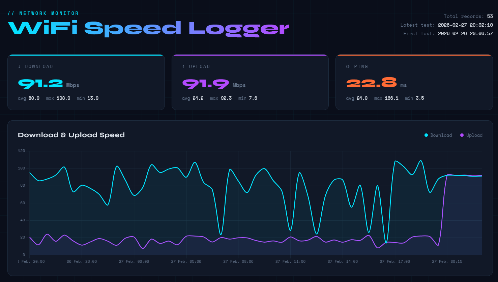

# 📡 WiFi Speed Logger

A lightweight Python tool that runs internet speed tests at custom intervals, logs results to CSV, and generates a beautiful self-contained HTML dashboard with interactive charts.



---

## Features

- ⚡ Runs speed tests using `speedtest-cli`
- 📁 Logs download, upload, and ping to a CSV file
- 📊 Generates an interactive HTML dashboard (no server needed)
- 🔁 Supports scheduled testing at any interval
- 🧪 Demo mode to preview the dashboard without running tests

---

## Requirements

```bash
pip install speedtest-cli
```

> Python 3.7+ required. No other dependencies needed for logging. The dashboard is fully self-contained HTML.

---

## Usage

### Run a single speed test
```bash
python speed_logger.py
```

### Run every 30 minutes (logs + auto-regenerates dashboard)
```bash
python speed_logger.py --interval 30
```

### Generate dashboard from existing data
```bash
python speed_logger.py --dashboard
```

### Try it with demo data (no speed test needed)
```bash
python speed_logger.py --demo
```
Then open `dashboard.html` in your browser.

---

## Output Files

| File | Description |
|------|-------------|
| `speed_log.csv` | All test results with timestamps |
| `dashboard.html` | Interactive chart dashboard (open in browser) |

### CSV Format

```
timestamp,download_mbps,upload_mbps,ping_ms,isp,server
2024-01-15 14:30:00,87.4,19.2,12.3,Virgin Media,London
```

---

## Dashboard

The dashboard is a single `.html` file — just open it in any browser. It includes:

- **Stat cards** — latest, average, max, min for download, upload, and ping
- **Speed chart** — download and upload over time
- **Ping chart** — latency over time
- **Results table** — last 20 tests with quality rating

---

## Automation (Linux/macOS)

To run automatically every hour using cron:

```bash
crontab -e
```
Add:
```
0 * * * * /usr/bin/python3 /path/to/speed_logger.py
```

### Windows Task Scheduler
Use Task Scheduler to run `speed_logger.py` on a schedule.

---

## Project Structure

```
wifi-speed-logger/
├── speed_logger.py     # Main script
├── speed_log.csv       # Generated log file
├── dashboard.html      # Generated dashboard
└── README.md
```

---

## License

MIT — free to use, modify, and share.
